# Tugas Praktikum 1 DPBO 

## Program Data Film Bioskop
Program ini merupakan program pengelolaan data film bioskop yang dibuat menggunakan konsep **Object-Oriented Programming (OOP)**. Program dibuat dalam empat bahasa pemrograman, yaitu:
* Python
* C++
* Java
* PHP
Setiap program menggunakan class `Film` dan mengelola sekumpulan object `Film` dalam array atau list.

## 1. Janji
Saya Ingrid Gabryella Nainggolan dengan NIM 2506442 mengerjakan TP 1 dalam mata kuliah Desain dan Pemrograman Berorientasi Objek untuk keberkahanNya maka saya tidak melakukan kecurangan seperti yang telah dispesifikasikan.  Aamiin

## 2. Desain Program
Program menggunakan satu class utama yaitu `Film`.
Class `Film` memiliki atribut:
| Atribut      | Tipe Data | Keterangan             |
| ------------ | --------- | ---------------------- |
| `IdFilm`     | Integer   | ID atau identitas film |
| `Judul`      | String    | Judul film             |
| `Genre`      | String    | Genre film             |
| `HargaTiket` | Integer   | Harga tiket film       |
| `Studio`     | Integer   | Nomor studio           |
| `Gambar`     | String    | Path file gambar lokal |

## 3. Konsep OOP yang Digunakan
### Class
Class `Film` digunakan sebagai blueprint untuk membuat object film.

### Object
Setiap data film dibuat sebagai object dari class `Film`.

### Encapsulation
Atribut pada class dibuat private sehingga tidak dapat diakses secara langsung dari luar class. Pengaksesan dan perubahan data dilakukan melalui getter dan setter.

### Constructor
Constructor digunakan untuk memberikan nilai awal ketika object `Film` dibuat.

### Array/List of Object
Program mengelola sekumpulan object `Film` dalam array atau list. Setiap object menyimpan informasi satu film.

## 4. Fitur Program
### Tambah Data
Fitur tambah digunakan untuk memasukkan data film baru ke dalam program. Pengguna mengisi informasi seperti ID, judul, genre, harga tiket, studio, dan gambar film. Setelah data diisi, program membuat object film baru dan menyimpannya ke dalam kumpulan data film.

### Cari Data
Fitur cari digunakan untuk menemukan data film tertentu. Pengguna dapat memasukkan kata pencarian berdasarkan informasi film yang tersedia. Program kemudian menampilkan data film yang sesuai dengan pencarian.

### Edit Data
Fitur edit digunakan untuk mengubah informasi film yang sudah tersimpan. Pengguna memilih film yang ingin diubah, kemudian memperbarui informasi yang diperlukan. Data film yang telah diperbarui akan menggantikan data sebelumnya.

### Hapus Data
Fitur hapus digunakan untuk menghapus data film yang sudah tidak diperlukan. Pengguna memilih film yang ingin dihapus, kemudian program menghapus data tersebut dari kumpulan object film.

### Tampilkan Data
Fitur tampil digunakan untuk melihat seluruh data film yang telah tersimpan. Data ditampilkan dalam bentuk daftar atau tabel sesuai dengan bahasa pemrograman yang digunakan.

## 5. Implementasi pada 4 Bahasa
### Python
Program Python menggunakan list untuk menyimpan kumpulan object `Film`. Program dijalankan melalui terminal dan menyediakan menu untuk mengelola data film.

### C++
Program C++ menggunakan array of object untuk menyimpan data film. Program dijalankan melalui terminal dengan menu untuk melakukan berbagai operasi terhadap data.

### Java
Program Java menggunakan array object untuk menyimpan kumpulan data film. Program dijalankan melalui terminal menggunakan class `Film` sebagai blueprint object.

### PHP
Program PHP menggunakan array yang berisi object `Film`. Program dibuat dalam bentuk website sehingga proses pengelolaan data dilakukan melalui browser.
Pada PHP, gambar film disimpan secara lokal di dalam folder `images` dan path gambar menjadi salah satu atribut pada class `Film`.

## 6. Struktur File
```text
TP1DPBO2526C2/
│
├── Python/
│   ├── Film.py
│   └── Main.py
│
├── C++/
│   ├── Film.cpp
│   └── Main.cpp
│
├── Java/
│   ├── Film.java
│   └── Main.java
│
└── PHP/
    ├── Film.php
    ├── Index.php
    ├── style.css
    └── images/
```

## 7. Dokumentasi
### C++
<table>
<tr>
<td>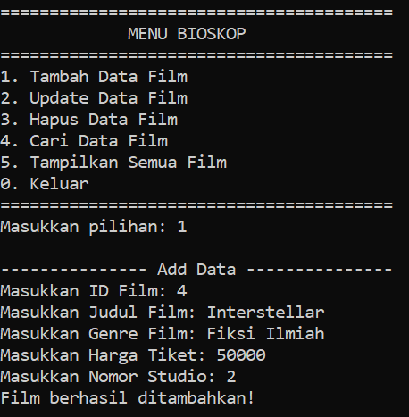</td>
<td>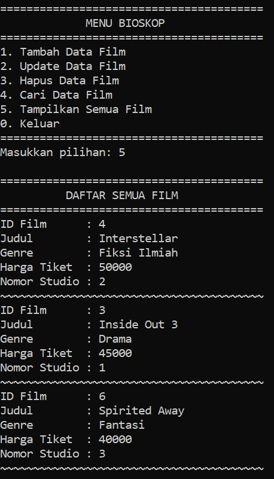</td>
<td>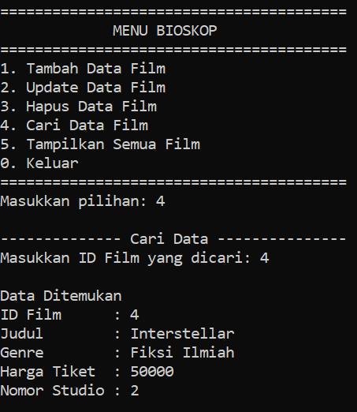</td>
</tr>
<tr>
<td>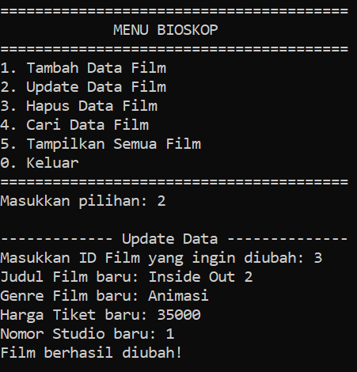</td>
<td>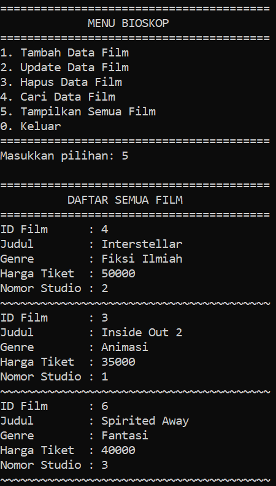</td>
<td>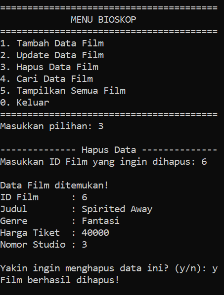</td>
</tr>
<tr>
<td>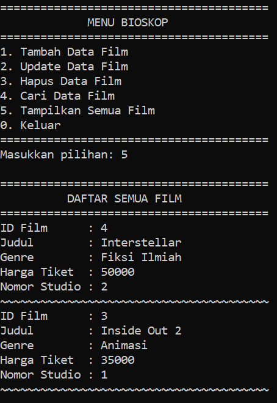</td>
<td>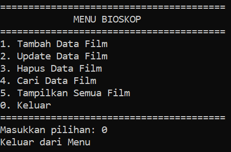</td>
<td></td>
</tr>
</table>

### Java
<table>
<tr>
<td>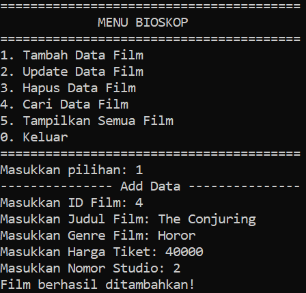</td>
<td></td>
<td>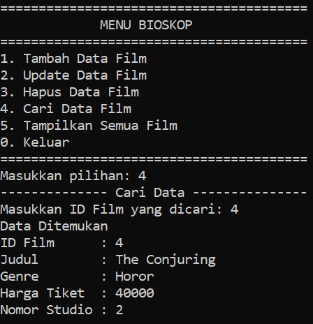</td>
</tr>
<tr>
<td>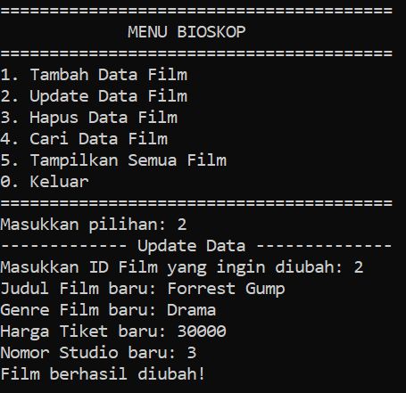</td>
<td>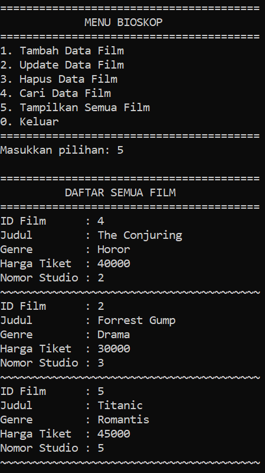</td>
<td>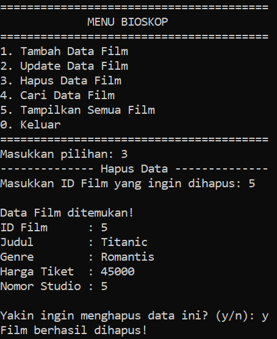</td>
</tr>
<tr>
<td>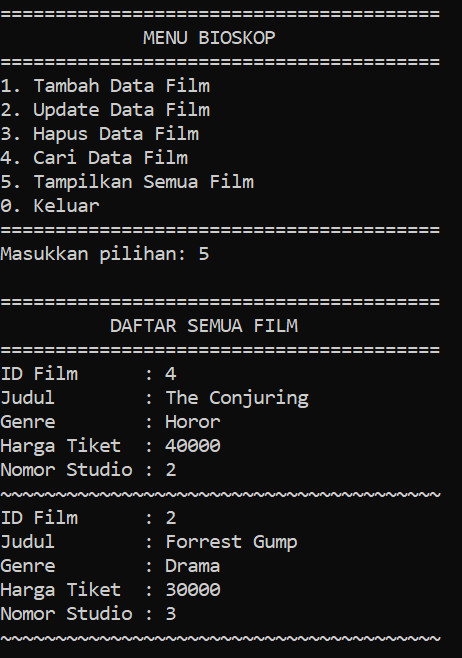</td>
<td>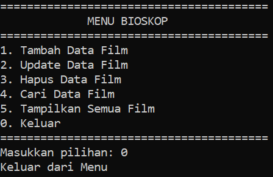</td>
<td></td>
</tr>
</table>

### PHP
<table>
<tr>
<td>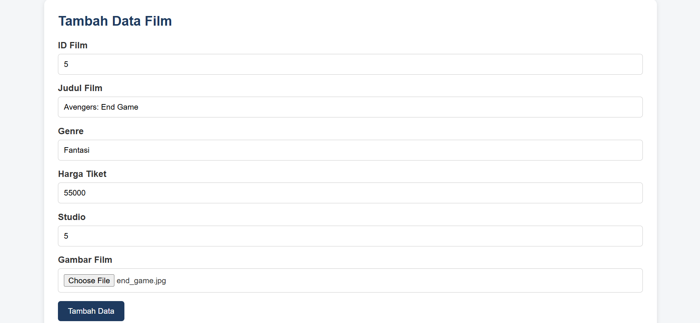</td>
<td>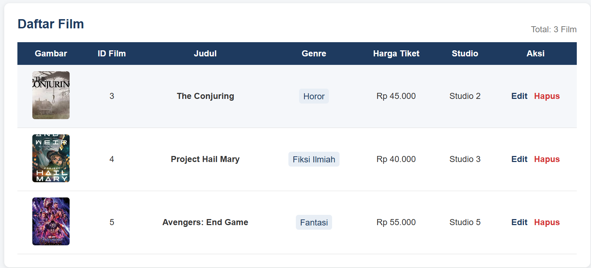</td>
<td>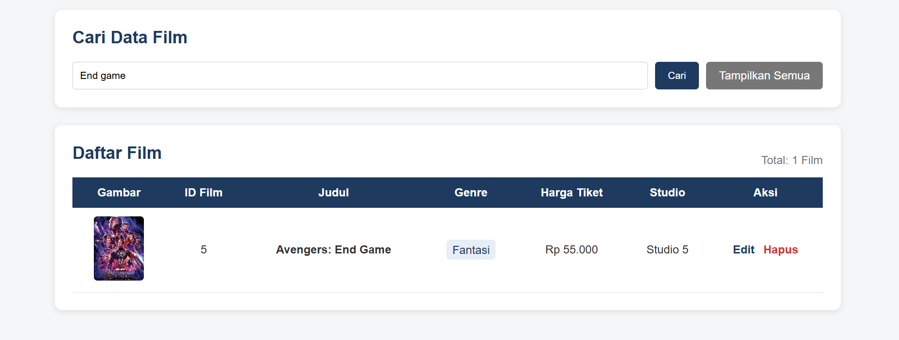</td>
</tr>
<tr>
<td>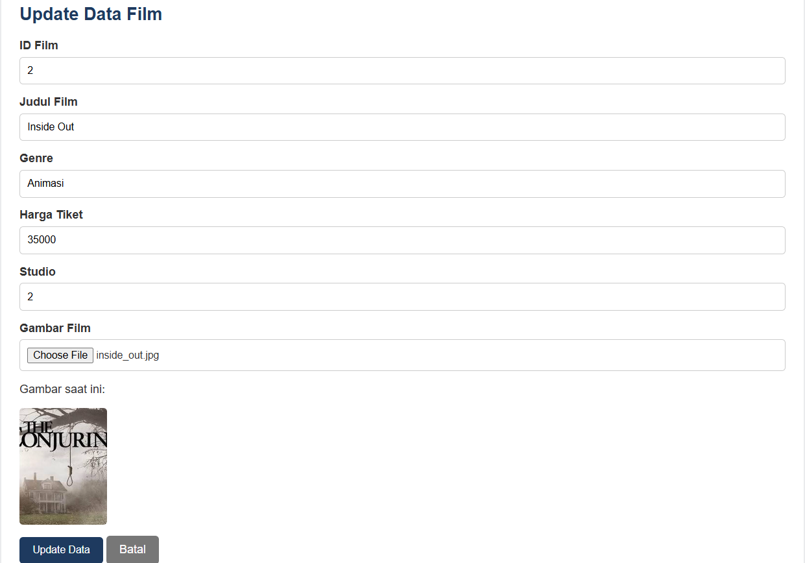</td>
<td>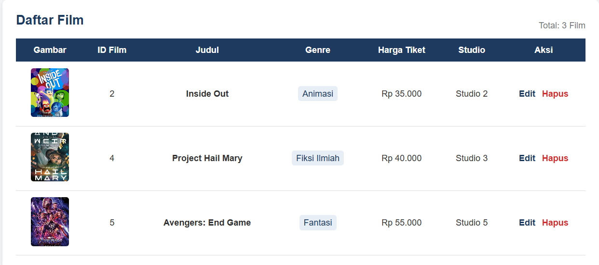</td>
<td>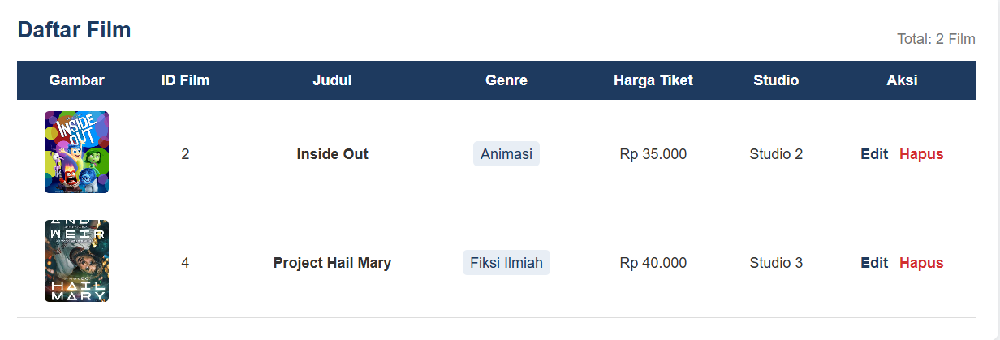</td>
</tr>
</table>

### Python
<table>
<tr>
<td>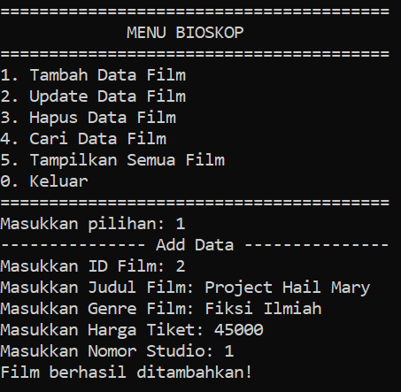</td>
<td>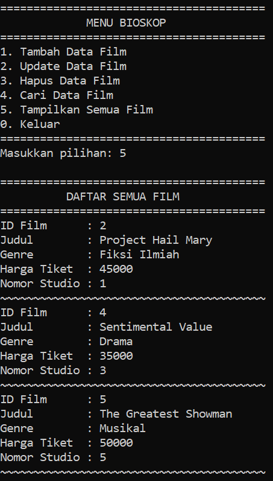</td>
<td>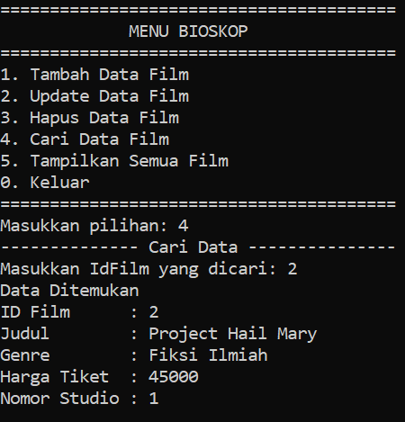</td>
</tr>
<tr>
<td>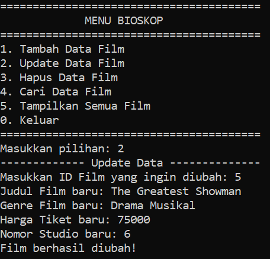</td>
<td>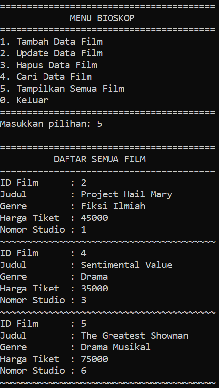</td>
<td>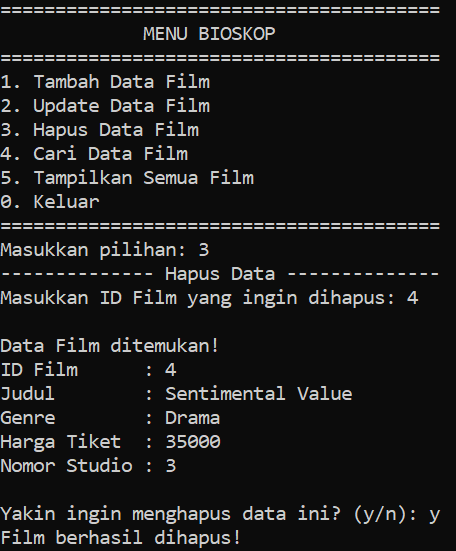</td>
</tr>
<tr>
<td>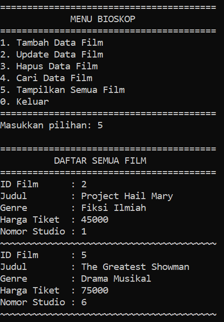</td>
<td>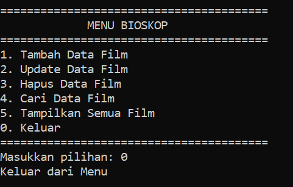</td>
<td></td>
</tr>
</table>
